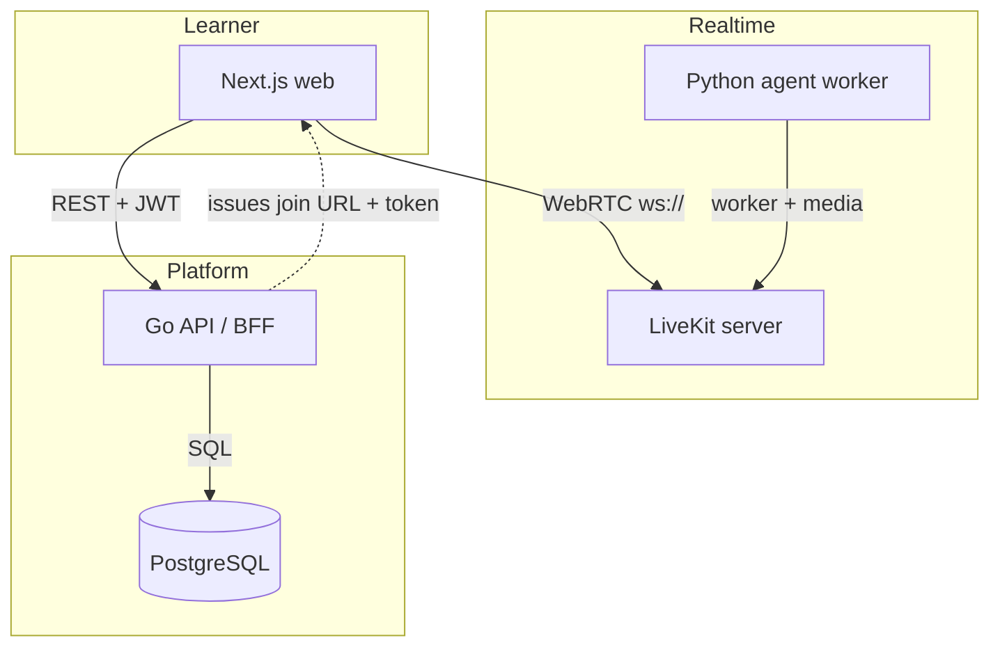
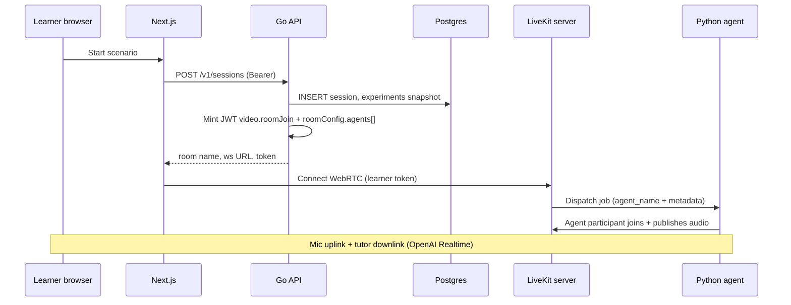

# FluentFlow — Real-time AI language tutor

[](https://github.com/mehdi/fluentflow/actions/workflows/go-test.yml)
[](https://github.com/mehdi/fluentflow/actions/workflows/web.yml)
[](https://github.com/mehdi/fluentflow/actions/workflows/docs.yml)

**FluentFlow** is a production-minded, **speaking-first** language learning stack: learners pick scenarios, join a **LiveKit** room with a **Python voice agent** (OpenAI Realtime), and receive **post-session feedback** (OpenAI `gpt-4o-mini` when configured, otherwise a deterministic stub). A **Go** API owns auth, profiles, experiments, session lifecycle, analytics events, and **Prometheus** metrics. The **Next.js** app is the learner UI.

| Resource | Link |
|----------|------|
| **Online documentation** (GitHub Pages) | After you enable Pages: `https://<your-username>.github.io/<repository-name>/` — see [docs/deployment.md](docs/deployment.md) |
| **Product / systems PRD** | [docs/prd.md](docs/prd.md) |
| **PRD → implementation map** | [docs/IMPLEMENTATION_MATRIX.md](docs/IMPLEMENTATION_MATRIX.md) |
| **Recruiter narrative** | [RECRUITER.md](RECRUITER.md) |

**Why it exists:** Most language apps optimize for passive drills. This project demonstrates **real-time voice**, **explicit agent dispatch**, **experiment assignment**, **observability hooks**, and a **thin live path vs async feedback** split — the kind of story hiring teams expect on senior AI/platform portfolios.

---

## Table of contents

1. [What this demonstrates](#what-this-demonstrates)
2. [Architecture](#architecture-systems)
3. [Quick start (Docker)](#quick-start-docker)
4. [Tests and verification](#tests-and-verification)
5. [Documentation and GitHub Pages](#documentation-and-github-pages)
6. [Deployment (production)](#deployment-production)
7. [Scaling](#scaling)
8. [Monitoring](#monitoring)
9. [API surface (v1)](#api-surface-v1)
10. [Key technical decisions](#key-technical-decisions)
11. [Repository layout](#repository-layout)
12. [License](#license)

---

## What this demonstrates

- **LiveKit end-to-end:** self-hosted `livekit-server` (dev), browser client (`livekit-client`), join tokens minted by your API with **`roomConfig` agent dispatch** (see [LiveKit agent dispatch](https://docs.livekit.io/agents/server/agent-dispatch/)).
- **Voice agent:** `livekit-agents` worker with **Silero VAD** + **OpenAI Realtime** (`OPENAI_API_KEY` required for real speech).
- **Session UX:** chat-style transcript, de-duplication, per-message **Translate** / **Analyze** (API-backed with stub fallbacks).
- **Backend:** modular Go service (Chi, JWT, bcrypt, pgx, CORS, `/metrics`, `/healthz`).
- **Data:** Postgres for users, profiles, sessions, events, experiments, flags, feedback, learning snapshots.
- **Product instrumentation:** session event taxonomy, experiment snapshots, feature flags.
- **CI:** GitHub Actions for Go, web, and **documentation** builds.

---

## Architecture (systems)



### How the LiveKit agent joins

When the learner starts a session, the API returns a **short-lived JWT** whose claims include **room join** permissions and **`roomConfig.agents`**: a `RoomAgentDispatch` for `fluentflow-tutor` plus **JSON metadata** (scenario, level, goals). The browser connects; LiveKit **dispatches a job** to the Python worker, which runs the voice session in that room.



---

## Quick start (Docker)

**Prerequisites:** Docker Desktop (or compatible), and an **OpenAI API key** for real voice and LLM feedback.

1. Copy env and set your key (recommended):

   ```bash
   cp .env.example .env
   # OPENAI_API_KEY=sk-...
   ```

2. From the repo root:

   ```bash
   docker compose up --build
   ```

   Detached:

   ```bash
   docker compose up -d --build
   ```

3. Open **http://localhost:3000** — register, profile, scenario, **Connect to room**.

| Port | Service |
|------|---------|
| 3000 | Next.js |
| 8080 | Go API |
| 7880 | LiveKit (WS) |
| 5432 | Postgres |

**LiveKit dev defaults:** API key `devkey`, secret `secret` (see [LiveKit local dev](https://docs.livekit.io/home/self-hosting/local/)).

**Disable tutor dispatch (client-only debugging):** set `LIVEKIT_AGENT_NAME=` empty in `.env`.

**Agent Realtime knobs:** `OPENAI_REALTIME_MODEL`, `OPENAI_TRANSCRIPTION_MODEL`, `OPENAI_TTS_VOICE` (see `.env.example`).

**Windows / Docker UDP issues:** Hyper-V can reserve `50000–502xx`. This repo uses [`livekit-docker.yaml`](livekit-docker.yaml) (UDP mux on **7882** only).

**Local dev without Docker:** see [docs/getting-started.md](docs/getting-started.md).

---

## Tests and verification

```bash
make test
```

Full check (Go vet + tests + Next.js lint + production build; Node 20+):

```bash
make verify
```

Avoid `go test ./...` from the repo root if `web/node_modules` contains nested Go packages.

**Learning the codebase:** [teach.md](teach.md).

---

## Documentation and GitHub Pages

The repository includes a **MkDocs Material** site ([`mkdocs.yml`](mkdocs.yml), [`docs/`](docs/)) deployed by [`.github/workflows/docs.yml`](.github/workflows/docs.yml).

1. Push this repository to GitHub.
2. **Settings → Pages → Build and deployment → Source:** choose **GitHub Actions**.
3. Merge to `main` (or run the **Deploy documentation** workflow manually). The site appears at:

   `https://<github-username>.github.io/<repository-name>/`

**Preview locally:**

```bash
pip install -r requirements-docs.txt
mkdocs serve
```

**Build static site to `./site`:**

```bash
make docs
```

**Guides in the docs site:**

| Topic | File |
|-------|------|
| Getting started | [docs/getting-started.md](docs/getting-started.md) |
| GitHub + production deployment | [docs/deployment.md](docs/deployment.md) |
| Scaling | [docs/scaling.md](docs/scaling.md) |
| Monitoring (Prometheus, Grafana, alerts) | [docs/monitoring.md](docs/monitoring.md) |

**Forking:** Badge URLs and `repo_url` in `mkdocs.yml` point at `mehdi/fluentflow` (see `go.mod`). Replace with your fork if needed.

---

## Deployment (production)

FluentFlow is **multi-service** (Postgres, LiveKit, API, web, agent). Production usually means **container images**, a **managed database**, **TLS**, and **WSS** for WebRTC.

- **High-level checklist:** [docs/deployment.md](docs/deployment.md) — HTTPS, secrets, optional LiveKit Cloud, CI/CD patterns.
- **GitHub Actions** in this repo run **tests** and **publish docs**; **application** deploy to your cloud is environment-specific (build/push images, run migrations, roll out).

---

## Scaling

The API is **stateless** behind a load balancer; **Postgres**, **LiveKit**, and **agent workers** scale on different axes. Read the full guide: **[docs/scaling.md](docs/scaling.md)** — connection pooling, PgBouncer, LiveKit clustering / cloud, horizontal agent workers, OpenAI quotas, and cost-aware capacity.

---

## Monitoring

The Go API exposes **`GET /healthz`** (liveness) and **`GET /metrics`** (Prometheus). Metrics include `fluentflow_http_requests_total`, `fluentflow_http_request_duration_seconds`, and `fluentflow_session_events_ingested_total`. Internal admin routes under `/internal/v1/` require `ADMIN_TOKEN`.

**Full runbook:** **[docs/monitoring.md](docs/monitoring.md)** — scrape config, PromQL examples, Grafana panels, alerting, logs, and trace extensions.

---

## API surface (v1)

| Method | Path | Notes |
|--------|------|-------|
| POST | `/v1/auth/register`, `/v1/auth/login`, `/v1/auth/guest` | JWT; guest → `is_guest` |
| GET | `/v1/me` | |
| DELETE | `/v1/me/account` | JSON `{"password"}` (omit for guest) |
| GET | `/v1/me/learning-snapshots` | Query `limit` |
| GET/PUT | `/v1/me/profile` | |
| GET | `/v1/scenarios`, `/v1/experiments`, `/v1/feature-flags` | |
| GET | `/v1/sessions`, POST `/v1/sessions` | `scenario_title` on items |
| GET | `/v1/sessions/{id}` | |
| POST | `/v1/sessions/{id}/livekit-token` | |
| POST | `/v1/sessions/{id}/events` | |
| POST | `/v1/sessions/{id}/transcript` | |
| GET | `/v1/sessions/{id}/transcript` | |
| POST | `/v1/sessions/{id}/complete` | |
| GET | `/v1/sessions/{id}/feedback` | `generation_source`, `recommended_scenario_title` |
| POST | `/v1/sessions/{id}/feedback/generate` | |
| POST | `/v1/sessions/{id}/feedback/viewed` | |
| POST | `/v1/sessions/{id}/recommendation-click` | |
| GET | `/v1/sessions/{id}/events` | |
| POST | `/v1/ai/translate`, `/v1/ai/analyze` | |
| GET | `/v1/dashboard/summary` | |
| GET | `/internal/v1/overview`, `/internal/v1/experiments`, `/internal/v1/metrics/summary` | Admin |
| PATCH | `/internal/v1/feature-flags/{key}` | Admin |
| GET | `/healthz`, `/metrics` | Ops |

---

## Key technical decisions

1. **Agent dispatch in the join token** — fewer moving parts; dispatch remains explicit via `agent_name` on the worker.
2. **OpenAI at two speeds** — Realtime for live tutoring; `gpt-4o-mini` for structured post-session feedback.
3. **Postgres as source of truth** — sessions and `session_events` for dashboards and export.
4. **Prometheus first** — `/metrics`; traces can be added without changing the domain model.

---

## Repository layout

```
cmd/api/           # HTTP entrypoint
internal/api/      # Handlers, middleware
internal/store/    # Postgres access
internal/livekit/  # Join JWT + roomConfig dispatch
internal/openai/   # Post-session + message tools
internal/migrate/  # Embedded SQL
web/               # Next.js App Router UI
agent/             # LiveKit Agents tutor
docs/              # MkDocs source (plus PRD & matrix)
mkdocs.yml         # Documentation site config
.github/workflows/ # CI: Go, Web, Docs → GitHub Pages
```

---

## License

Portfolio / educational use unless you add your own license.
