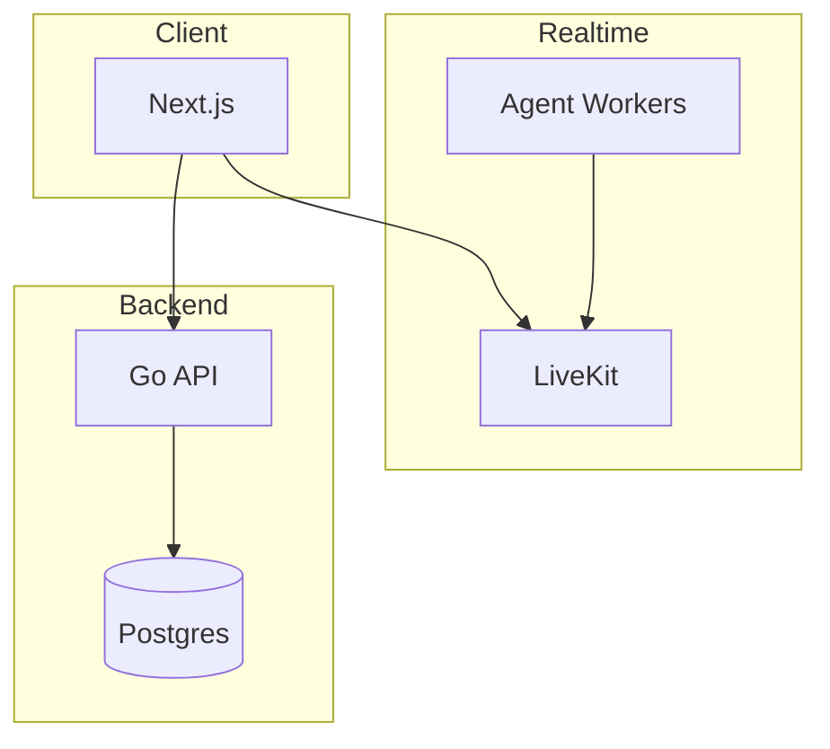
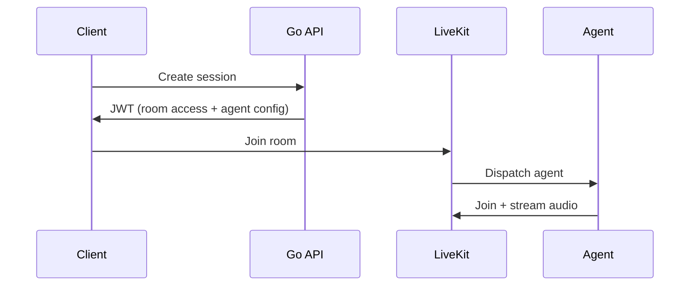

# FluentFlow — Production-Ready Real-Time AI Voice Agent


> A **scalable real-time AI system** built with WebRTC, LiveKit, Go, and OpenAI
> Designed with **production architecture**, not just a demo

---

## 🚀 What This Project Demonstrates

FluentFlow is not just an AI app—it is a **distributed real-time system**.

This project demonstrates:

* building **real-time AI voice agents** (not request/response apps)
* designing **scalable backend systems** (stateless API + durable DB)
* orchestrating **AI workers in real-time environments**
* applying **production patterns** (metrics, health, failure isolation)

👉 This is a **system design problem implemented end-to-end**

---

## 🔗 Links

* **GitHub (this repo)**
  https://github.com/mehdiShariati/fluentflow

* **Live Documentation (architecture, scaling, deployment)**
  https://mehdishariati.github.io/fluentflow/

* **LiveKit (real-time infrastructure)**
  https://github.com/livekit

* **Learn AI Voice Agents (recommended course)**
  https://learn.deeplearning.ai/courses/building-ai-voice-agents-for-production/information

---

## 🧠 Why This Exists

Most AI apps today follow a simple pattern:

```
request → response
```

That model breaks for voice.

Voice requires:

* continuous streaming
* low latency
* real-time coordination

> You are not building an API—you are building a **real-time system**

FluentFlow explores what that looks like in practice.

---

## 🏗 System Architecture



### Architecture Principles

* **Stateless API** → horizontally scalable
* **Realtime separated** → independent scaling
* **AI workers decoupled** → distributed execution
* **Postgres as source of truth** → durability

👉 Designed for **production scaling from day one**

---

## ⚡ How It Works (High-Level Flow)



### Key Pattern: Agent Dispatch

Instead of calling the AI directly:

* API generates a JWT with `roomConfig`
* LiveKit dispatches an agent automatically
* agent joins as a participant

👉 This enables **clean, scalable orchestration**

Docs:
https://docs.livekit.io/agents/server/agent-dispatch/

---

## 📈 Scaling Strategy (Production Thinking)

FluentFlow scales by **separating concerns**, not scaling a monolith.

---

### API Layer (Stateless)

* no in-memory state
* horizontally scalable
* behind load balancer

👉 scales with request volume

---

### Realtime Layer (LiveKit)

* handles WebRTC connections
* scales independently
* supports clustering / cloud

👉 scales with concurrent sessions

---

### AI Agent Workers

* horizontally scalable
* multiple workers per agent
* distributed via LiveKit

👉 scales with AI workload

---

### Database (Postgres)

* durable state
* requires:

  * connection pooling
  * indexing
  * migration control

👉 scales carefully (stateful)

---

### Key Insight

> Each component scales independently based on its bottleneck

---

### Failure Isolation

* API failure ≠ realtime failure
* agent crash ≠ system crash
* DB remains consistent

👉 system degrades gracefully

---

## ☁️ Deployment Options

### Self-Hosted (Development / Control)

* full control over infra
* learn WebRTC internals
* lower cost

---

### LiveKit Cloud (Production)

https://livekit.io

* managed infrastructure
* global low-latency routing
* automatic scaling

👉 recommended for production workloads

---

## 🧑‍💻 Tech Stack

| Layer         | Stack                                  |
| ------------- | -------------------------------------- |
| Web           | Next.js + LiveKit client               |
| API           | Go (chi), JWT, PostgreSQL              |
| Realtime      | LiveKit (WebRTC SFU)                   |
| AI            | Python (`livekit-agents`, OpenAI, VAD) |
| Observability | Prometheus (`/metrics`, `/healthz`)    |

---

## 🚀 Quick Start

```bash
cp .env.example .env
# add OPENAI_API_KEY

docker compose up --build
```

Open:

👉 http://localhost:3000

---

## 🎓 Learning Path (Recommended)

If you want to understand this deeply:

👉 https://learn.deeplearning.ai/courses/building-ai-voice-agents-for-production/information

This project is a **practical implementation of those concepts**:

* real-time pipelines
* AI orchestration
* production deployment

---

## 🧪 Production Features

* metrics (`/metrics`)
* health checks (`/healthz`)
* event tracking
* feature flags
* structured feedback pipeline

👉 not a demo—built with **operational thinking**

---

## 🗂 Repository Structure

```
cmd/api/           # API entrypoint
internal/          # backend logic
agent/             # AI workers
web/               # frontend
docs/              # system docs
```
