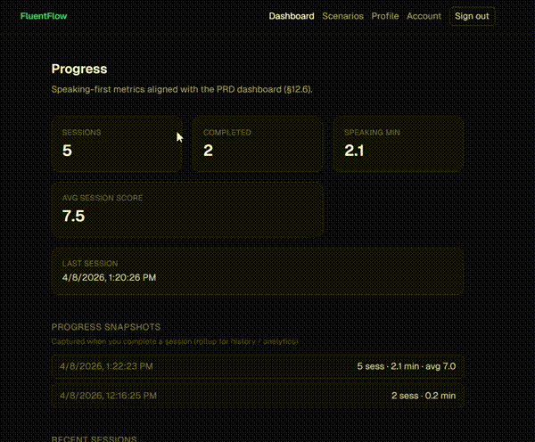

# FluentFlow — Production-Ready Real-Time AI Voice Agent

Built a real-time AI system handling voice streaming, agent orchestration, and scalable backend design.

> A **scalable real-time AI voice system** built with WebRTC, LiveKit, Go, and OpenAI  
> Designed with **production architecture**, not just a demo

---

## 🚀 What This Project Shows

This project demonstrates how to build:

- real-time AI voice agents (not request/response apps)
- scalable backend systems (stateless API + durable DB)
- distributed AI workers (LiveKit agent dispatch)
- production-ready infrastructure (metrics, health, events)

👉 This is not a toy project — it is a **system design exercise implemented end-to-end**

---

## 🔗 Links

- **GitHub (this repo)**  
  https://github.com/mehdiShariati/fluentflow  

- **Live Documentation (architecture, scaling, deployment)**  
  https://mehdishariati.github.io/fluentflow/

- **LiveKit (realtime infrastructure)**  
  https://github.com/livekit  

- **Learn Voice Agents (recommended course)**  
  https://learn.deeplearning.ai/courses/building-ai-voice-agents-for-production/information  

---

## 🧠 Why This Matters

Most AI apps today are built like this:

request → response

Voice AI does not work that way.

It requires:
- continuous streaming  
- low latency  
- real-time coordination  

Which means:

> You are building a **distributed real-time system**, not just calling an API

---

## 🏗 System Overview

FluentFlow is built with **clear separation of concerns**:

- **Control layer** → Go API + PostgreSQL  
- **Realtime layer** → LiveKit (WebRTC)  
- **AI layer** → Python agent workers  

This architecture allows each part to scale independently.

---

## ⚡ How LiveKit Is Used

LiveKit is the core of the real-time system:

- manages WebRTC connections  
- routes audio streams (SFU)  
- handles rooms and participants  

### Key Pattern: Agent Dispatch

Instead of calling the AI directly:

- API generates a JWT with `roomConfig`
- LiveKit automatically dispatches an agent worker
- agent joins the room like a participant

👉 This is a **production-grade pattern for AI agents**

Docs:
https://docs.livekit.io/agents/server/agent-dispatch/

---

## ☁️ Deployment Options

### Self-Hosted (used in development)
- full control  
- learn WebRTC internals  
- lower cost  

### LiveKit Cloud (recommended for production)
https://livekit.io

- managed infrastructure  
- global low-latency routing  
- automatic scaling  

---

## 🎓 How to Learn This Stack

If you want to build systems like this:

👉 https://learn.deeplearning.ai/courses/building-ai-voice-agents-for-production/information  

This project is a **practical implementation of those concepts**:
- real-time pipelines  
- AI orchestration  
- production deployment  

---

## 🧑‍💻 Use This As a Starter

You can build your own AI product from this:

- customize tutor prompts → `agent/tutor_agent.py`  
- add scenarios → `internal/api/scenarios.go`  
- extend UI → `web/`  
- deploy → see docs  

---

## 🏁 Key Engineering Signals

This system is designed with:

- stateless API (horizontal scaling)  
- durable state (PostgreSQL)  
- real-time infrastructure (LiveKit)  
- distributed workers (AI agents)  
- observability (`/metrics`, `/healthz`)  

👉 These are the same patterns used in production systems

---
